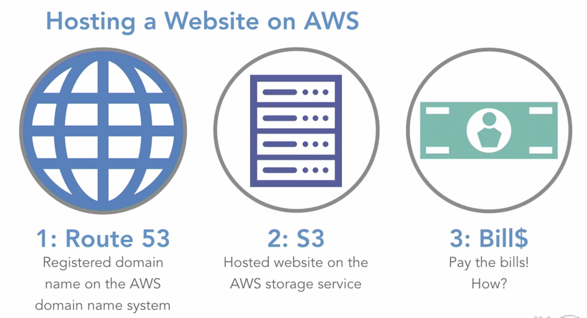

# Billing and Pricing

- Compare and contrast various pricing models for AWS
- Recognize the various account structures in relation to AWS billing and pricing
- Identify resources available for billing support

## AWS Support Plans

- Five support plans available with monthly fees ranging from free to over $15,000 per month
- Support plan types are Basic, Developer, Business Enterprise On-Ramp, and Enterprise

## Charges and Saving Money

- Different types of charges
- Main charges: compute, storage, data out
- There are ways to save money as a multi-account organisation (consolidated billing)

## Prepare Your App

### Billing concepts

- Estimate and plan your AWS costs
- Consolidated billing: simple accounting fort multiple AWS accounts within your organization
- Alert you when you're nearing usage thresholds, which could mean additional costs
- Use Cost Explorer to view costs as graphs

### Types of charges

#### Pay-As-You-Go Model of Cloud Computing

- No huge upfront costs
- Billed only for the resources consumed
- Easily scale resources up or down to suit business needs

#### Fundamental Drivers of Cost

1. Compute
   - Pay hourly from the time lunched to termination
   - EC2 (virtual server): Pay for length of time the server is up and running
2. Storage
   - Pay per GB of storage used
   - S3 (storage service): Upload photos into an app and pay for the storage used
3. Outbound Data Transfer
   - Pay to transfer data out of AWS
   - Usually no charge for ddata into AWS or data transfers between other AWS services (in other words, betweenS3 and EC2) within the same region

### Consolidated billing

- Create a payer AWS account to view and pay combined billing charges for all linked accounts in an organisation.

- Independent account, but can't use any other services
- Cannot deploy services into the linked accounts
- All resource usage becomes consolidated as usage from one large entity-organization may be eligible for volume discounts

### Cost calculators

#### Total Cost of Ownership (TCO) Calculator

- Get reports on estimated saving from moving on-premises IT infrastructure onto AWS cloud
- Total Cost of Ownership (TCO) includes upfront hardware/infrastructure costs and maintenance costs
- TCO can be reduced by moving to the cloud because no upfront infrastructure purchases
- Pay-As-You-Go model: pay only when your business uses the resources

#### AWS Pricing Calculator

- Estimate cost of a cloud architecture solution you want to build
- Add services and calculator to the calendar to get a report of estimated costs per service, service group, and total infrastructure
- Compare service costs per region, reduce EC2 spend, find the right EC2 instance to fit your needs, or estimate overall AWS cloud spend

#### Part of Billing and Cost Management Console

- Located in Billing and Cost Management console
- View and analyze your AWS cloud costs and usage
- Forecast how much you're likely to spend in upcoming month
- Get recommendations for what reserved instances to purchase to minimize costs

## Support Plans

### Basic

- No tech support; customer service limited to account and billing questions
- AWS community forums
- Seven core Trusted Advisor checks
- AWS Personal Health Dashboard

### Developer

- Greater of $29 per month or 3% of monthly AWS usage costs

- One primary contact to submit tech support requests
- Unlimited number of cases
- Technicians will respond during business hours via email
- Service-level agreement (SLA) for response: 12 hours for impaired system, 24 hours for general guidance

#### who uses

- Trying out features, deploying prototypes
- Assessing the viability of AWS within their IT infrastructure - need tech support
- Not fully committed to AWS yet, so `don't want to pay full support price`

### Business

- Cost: $100/mo OR 3-10% of monthly AWS usage bill (whichever is higher)
- Unlimited number of contacts can open unlimited number of support cases
- Access AWS Support API for support case automation
- Retrieve detailed information about support operations and data types in JSON format
- Full access to AWS Trusted Advisor checks
- Can retrieve Trusted Advisor check data through AWS Support API
- Access to Infrastructure Event Management (extra fees)
- Third-party application integration support
- SLA: 24/7 support via phone, email, and chat
- One-hour response time for urgent support cases when production system is down

### Enterprise

- Cost: $5,500 per month or 10% of monthly AWS usage bill (whichever is higher)
- Consultative application architecture guidance on how AWS resources can meet unique use case
- Short-term engagement with AWS Support for architectural and scaling guidance for Infrastructure Event Management
- Access to pool of Technical Account Managers (TAMs) and Concierge Support Team
- Access to management business reviews
- SLA: 24/7 support via phone, email, and chat
- 30 minutes response time for business-critical system down

