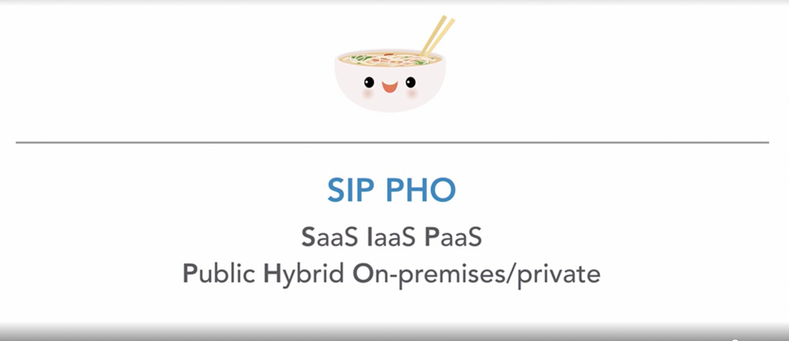

# Cloud Concepts

## Cloud Computing

### Cloud Computing Concept

**Cloud** connect all of our devices together -> pass information, store data

**Cloud Computing**: "On-demand delivery of compute, database storage, application, and other IT resources"

- Utilizes a pay-as-you-go model - pay only for what you use, when you use them (flexibility)
- Most transactions utilize "buy first to use"

### Collaboration with Cloud Computing

- Hold virtual meetings
- Edit documents together
- Communicate with messaging services
- Send emails

### Cloud Computing Features

- Instantaneous access
- Access resources where and when you want
- More flexible and affordable than legacy IT infrasturcture
- Affordable for organizations and individuals with small budgets

### `Advantages of Cloud Computing`

- Trade capital expense for variable expense
- Benefit from massive economies of scale
- Stop gussing capacity
- Increase speed and agility
- Stop spending money running and maintaining data centers
- Go global in minutes

### Cloud Computing Models

1. **Software as a Service (SaaS)**
   - "Completed products" managed by the service provider
   - Easy to use as end user
   - `Least flexibility`
2. **Platform as a Service (PaaS)**
   - Deploy and manage applications without worry
   - Execute programming languages to host applications
   - `Less flexibility` than IaaS, as packages are preconstructed
3. **Infrastructure as a Service (IaaS)**
   - Basic building blocks
   - `Most flexiblity` and `management control`
   - Closest to having traditional on-premises data center

### Cloud Computing Deployments

#### Cloud Deployment

- 100% of IT infrastructure on the cloud
- All applications migrated to or created in the cloud
- Removes roadblock of costly and time-consuming procurement processes
- Office 365 (emails), Teams (on-demand communication), Microsoft Azure (app development and hosting)

#### On-Premises/Private Cloud Deployment

- Use virtualization to deploy resources in their on-premises data centers
- Often looks like traditional IT infrastructure
- Does not provide a lot of benefit of cloud computing
- Resources cannot be accessed using the internet
- Security: Porvides dedicated resources

#### Hybrid Cloud Deployment

- Connects on-premises technology with cloud-based resources
- Great for established companies that are in the process of migrating over the cloud
- Data partially on the cloud, and partially in the on-premises data center
- Can use as backup and disaster recovery solution

### Design Principles of Cloud Computing

#### Well-Architected Framework

Build the most secure, durable, efficient, and high-performing IT infrastructure possible

1. **Cost Optimization**
   - Use only what you need
   - Reserve resources in advance
   - Continue to monitor for optimization
2. **Reliability**
   - Test disaster recovery settings
   - Incorporate redundancy
   - Have duplicate copies of resources
3. **Performance Efficiency**
4. **Security**
   - Best practices should be automated
   - Data should always be protected
   - Enable traceability
   - Manage access
5. **Operational Excellence**
   - Document everything
   - Refine operational procedures
   - Anticipate failure
   - Update processes
   - Learn from failure
6. **Sustainability**

## Introduce to AWS

### What is AWS

- Provides IT infrastructure services to organizations as web services
- Resources are accessed using the internet
- Utilizes the pay-as-you-go model to help organizations save money, time, and Human Resources

Cloud computing service provider that offers `flexibility, reliability and affordability`

### Services offered in AWS

1. **Compute Services**
   - Provide virtual server hosting, container management, and serverless computing
   - Instead of hosting server themselves, organizations can "rent" server compute space and capacities for cheap from AWS
   - No longer have to purchase physical servers or maintain data centers on-premises
2. **Storage Services**
   - Provide storage for both in-use and archival files
   - Different costs associated with how often you need to access the files and how durable or available you want them to be
   - Storage type for almost every level of need with very granular costs to meet budget requirements

3. **Database Services**
   - Fully managed relational and NoSQL databases
   - Also offers fully managed scalable petabyte-scale data warehouse service
   - Highly scalable and cost efficient: crunch data at a fraction of the cost of on-site database servers

### Use case: AWS Free Tier - WordPress AMI on EC2

#### EC2

- Elastic Compute Cloud (EC2) = Virtual server on AWS
- Host websites like WordPress
- Amazon Machine Images (AMI) = Preconfigured servers in AWS Marketplace

#### Route 53

- Route 53 is a domain name registrar
- Domain name registrar is a "phone book" for the internet

Route 53 (Domain registration) + EC2 AMI (WordPress template on a virtual server)