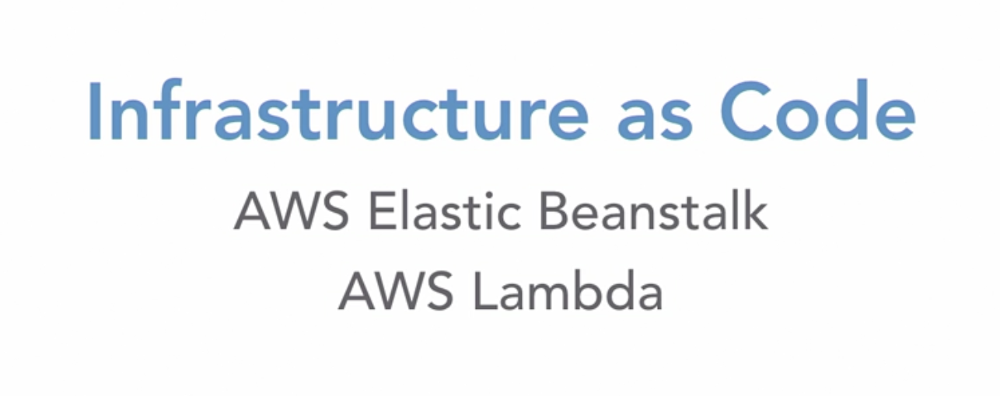
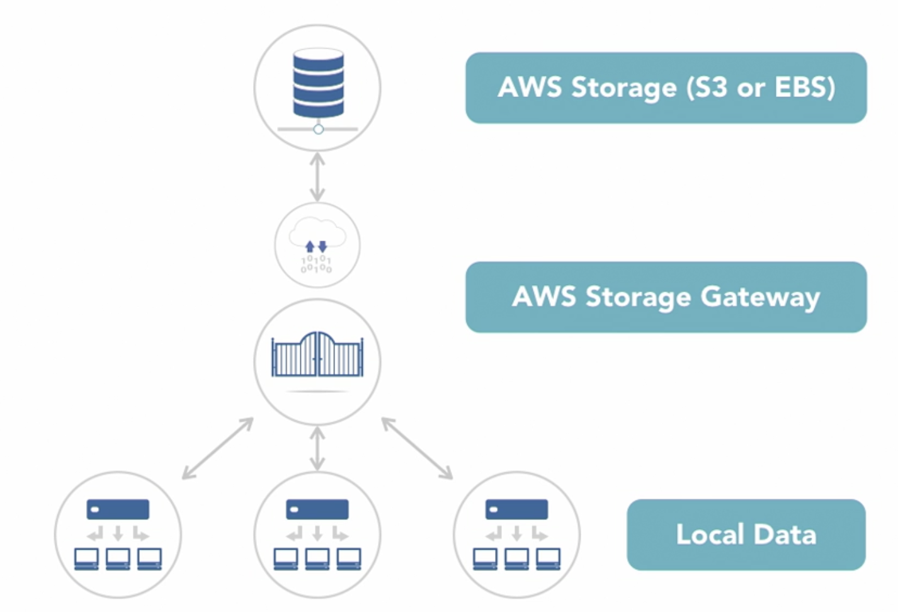
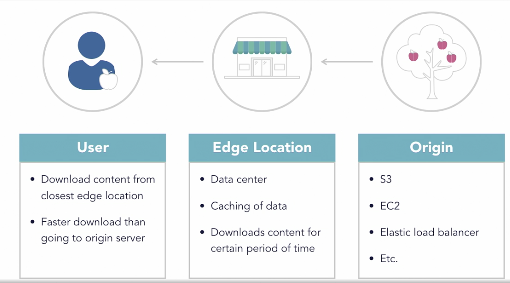

# Technology

- 33% of the exam
- Four parts
  - Define methods of deploying and operating in the AWS Cloud
  - Define the AWS global infrastructure
  - Identify the core AWS services
  - Identify resources for technology support

## Compute

### EC2

- Virtual server running on AWS
- Configurable by number of virtual CPUs, GBs of RAM, size/type of storage, and network speed
- Only charged for what you use, when you use it
- Deploy extremely scalable and reliable virtual servers within minutes

### Elastic Beanstalk

- Handles the deployment process
- Accommodates services developed using Java, .NET, PHP, Node.js, Python, Ruby, Go and Docker
- You retain full control over resources at all time
- Free to use
- Pay only for other AWS resources consumed to deploy
- Autoscaling
- Complete freedom to select AWS resources
- Allows manual management of infrastructure
- Provisions and operates the infrastructure

### Elastic Loading Balancing

- Automatically distributes incoming traffic across multiple replicated servers so no single server is overloaded
- Fault-tolerant
- `Scalable` and `secure`
- Monitor health of servers

### AWS Lambda

- Runs code (Lambda function) in response to an event
- Automatically runs uploaded code and scales applications
- Pay only for tthe time the code is running and each event trigger
- No need to provision and maintain servers

### Lightsail

- Preconfigured and ready-to-use operating systems, web apps, and developement stacks
- Scalable with your project's growth
- Cost-effective monthly fees
- One-click-to-launch services
- Easy to quickly deploy projects

### Deploying and operating in AWS

1. **AWS Management Console**
   - Graphical interface that supports most AWS services
   - Can access billing statements, launch new services, check out health of web apps, and so on
   - User-friendly and easy to navigate
2. **AWS Command-Line Interface (CLI)**
   - Access AWS services via the command line
   - Command line: access and change resources via text-based command entry
   - Programming language agnostic
   - Create scripts to run on AWS
3. **AWS Software Development Kits (SDKs)**
   - Incorporate connectivity and fucntionality of a wide range of AWS services into your code
   - Deploy AWS services and resources using a variety of popular programming languages
   - Use AWS resources in existing applications

#### Infrastructure as Code

- Deploy resources into AWS Cloud using code
- Some examples of AWS services that utilize infrastructure as code
  - Elastic Beanstalk
  - AWS Lambda
  - AWS CloudFormation

### AWS Global Infrastructure

#### Availability Zones (AZs)

- AWS data centers around the world
- Completely independent of each other in network and power source
- Currently almost six dozen Availability Zones (AZs) around the world

#### Regions

- Made up of two or more Availability Zones
- Currently two dozen AWS Regions around the world

#### High Availability

- Highly available resources may have duplicate copies in multiple Availability Zones or even Regions
- Resiliency: Ability to provide uninterrupted performance, even during natural disasters
- Redundancy: Having multiple copies of data in different data centers

- Architect your AWS Cloud infrasstructure to protect against downtimes caused by natural disasters or power outages

### Storage

### Amazon Simple Storage Service (S3)

- Object storage service: storing each file as separate entity (object)
- High availability, security, and performance
- Scalable
- Charged only for what you use
- 99.999999999% durable (11 9s)

- Upload files (objects) of all sizes (0 byte ~ 5 terabytes)
- Variety of uses: Use uploaded files for websites, mobile apps, backup and archiving, enterprise applications, IoT devices, big data analytics
- Easy-to-use management features to fine-tune access controls

1. Standard
2. Intelligent-Tiering
3. Standard-Infrequent Access
4. One Zone-Infrequent Access
5. Glacier
6. Glacier Deep Archive

### Elastic Block Store (EBS)

- Raw. unformatted block device atttached to an EC2 instance
- Can add multiple EBS volumes to one EC2 instance
- Use as file systems or hard drives
- Dynamically change configurations to attached volumes via management console
- Automatically replicated within its availability zone
- Different types of EBS storage types for your needs and budgets
- Persistent block storage volumes: do not disappear when EC2 instances are rebooted
- Can be encrypted
- Exist independently of EC2 instances so can be moved to other instances 

### Snowball

- Data migration tool
- Hardware solution: AWS will physically ship you a Snowball to move your data onto a ship back
- You can move 50 terabytes with a regular Snowball up to 100 petabytes with a Snowmobile (45-foot-long shipping container)
- Usage fee: free for 10 days of onsite usage; extra usage fees for every extra day you keep it
- Service fee per job starting at $200
- Storage fee: storage fee for data transferred into S3 (but no transfer fee)
- Snowmobile: expensive!

### AWS Storage Gateway

#### Hybrid Storage Solution

#### AWS Storage Gateway: File Gateway

- File stored as objects in S3
- One-to-one representation of each file
- Asynchronously updates objects to S3 as local files are updated
- Local cache to provide low-latency access to recently accessed files

#### AWS Storage Gateway: Volume Gateway

- Upload files in blocks (like virtual hard drives)
- Asynchronously backed up as point-in-time snapshots and stored as Elastic Block Store snapshots
- **Stored volume**: complete copy on-premises; sends snapshots to AWS
- **Cached volume**: keeps most recently accessed data on-premises; complete copy on AWS

#### AWS Storage Gateway: Tape Gateway

- Uses existing tape-based backup infrastructure to back up to virtual tapes
- Data stored locally then asynchronously uploaded to S3
- Data can be archived using Amazon Glacier

#### AWS Storage Gateway Pricing

- You'll pay for storage and to access the stored data
- The quicker you can access the data, the more expensive the solution is
- For example, data stored via tape gateway is much cheaper saved to S3 Glacier Deep Archive than S3 Glacier

## Database

### Amazon DynamoDB

- Secure, scalable, fast, and flexible NoSQL database
- Virtually unlimited throughput and storage
- Serverless: no need to probision, manage, or update your own servers
- AWS automatically scales your tables
- Pay for specific workload or for what you use

### Amazon Relational Database Service (RDS)

- Relational database
- Only pay for what you use or reserve at on-demane pricing (cheaper)
- AWS takes care of the provisioning, monitoring, and maintaining the database
- Compatible with PostgreSQL, MySQL, MariaDB, Oracle Database, Microsoft SQL Server, and Amazon Aurora

- Existing database can be migrated using AWS Database Migration Service

### Amazon Aurora

- One of six relational databases supported by Amazon RDS
- Fully managed by RDS; no administration or provisioning necessary
- Monitor performance through AWS alerting services
- MySQL and PostgreSQL compatible, but faster and cheaper
- Databases up to 64 TB per instance
- Hosted on distributed, fault-tolerant, self-healing storage systems with low latency
- Can migrate existing MySQL or PostgreSQL databases using AWS Database Migration Service

### Amazon Redshift

- Fully managed, petabyte-scale data warehouse service
- Super fast, super cheap
- You pay for what you use
- Fully integrated with your data lakes
- Deploy new data warehouse in minutes
- Secure
- Data encryption compliant with many common requirements

## Network and Content Delivery

### Amazon Virtual Private Cloud (VPC)

- Logically isolated section in the cloud to provision resources
- Flexible and secure, allowing you to control almost every aspect of your virtual network
- VPC automatically provisioned at AWS account signup

### CloudFront

- CloudFront is a global content delivery network (CDN)
- Based on location of the user, origin of the website/application, location of the content delivery server
- Integrates with many AWS services to provide optimal performance and security
- Makes loading website/apps for end users faster using edge locations to cache files and resources

- Scalable
- No minimum commitment or fixed-term contract
- Only pay for content delivered using the service 

### Route 53

- Highly scalable cloud Domain Name System (DNS)
- Reliably and cost-effectively route end users to your internet applications
- Connect user requests to infrastructure running on AWS
- Route users to infrastructure outside of AWS as DNS service
- Integrates with other AWS services
- Simple to set up, fast, secure, and cost-effective
- You're charged only for what you use, without any upfront fees or minimum usage commitments
- Automatically scales to handle large query volumes

#### Basic functions

- Domain registration
- Domain Name System
- Health check of web apps
- Auto naming for service discovery
- Create websites/apps with high availability

## Management Tools

### CloudFormation

- Templates: recipes for resource deployment in AWS
- Provision and deploy fully configured infrastructure
- Free to use
- Pay only for resources used in the templates
- Provision multi-region, multi-tier application quickly with text file
- Update or manage the templates (stacks) using AWS Management Console, command line, or Software Development Kit (SDK)
- Version control available

#### Infrastructure as Code

Deploy IT infrastructure based on text file that specifies resources and configurations for each service being deployed.

### CloudTrail

- Monitoring and auditing of IT infrastructure for compliance, user activity/API usage tracking, and risk auditing
- Log and monitor account activities and event history
- Simplify compliance audits
- Discover/troubleshoot security and operational issues
- Provide visibility into user/resource activities
- Automatically respond to security threats
- Track actions taken through AWS Management Console, SDKs, and command-line tools
- Review logs using CloudTrail event history
- Deliver reports to S3 buckets or CloudWatch logs and events
- Free review of account activities for the past 90 days
- Set up CloudTrail to deliver copy of management events in each region to S3
- Logging of data events has small fees

### CloudWatch

- Monitoring and management system for AWS infrastructure
- Natively integrated with over 70 AWS services

- Gain system-wide visibility into resource utilization, application performance, and operational health
- Get notifications in real time on data, metrics, and events

## Review

### Services

- Compute
- Storage
- Database
- Network and content delivery
- Management tools

### Concepts

- Infrastructure as code
- Deploying on the AWS Cloud
- Availability Zones and Regions

### Compute Services

- **Amazon EC2**: Virtual server
- **AWS Elastic Beanstalk**: Automatically "grows" your application
- **Elastic Load Balancing**: Balances incoming traffic loads
- **AWS Lambda**: Runs serverless code (Lambda Functions)
- **AWS Lightsail**: Preconfigured virtual servers

### Storage Services

- **Amazon S3**: Object storage (files)
- **Amazon EBS**: Block storage (hard drive)
- **AWS Snowball**: Transfers huge amounts of data (physical device)
- **AWS StorageGateway**: Gateways to connect office to resources uploaded on the cloud

### Database Services

- **Amazon DynamoDB**: NoSQL (nonrelational) database
- **Amazon RDS**: Relational database that supports six types of database engines
- **Amazon Aurora**: Relational database running on Amazon RDS
- **Amazon Redshift**: Data warehouse for A LOT of data

### Network and Content Delivery Services

- **Amazon VPC**: Private virtual network
- **Amazon CloudFront**: Caches content to Edge Locations to load faster
- **Amazon Route 53**: Routes domains to services and IP addresses

### Management Tools

- **AWS CloudFormation**: Form resources with templates
- **AWS CloudTrail**: Tracks "trails" of action (audit logs)
- **Amazon CloudWatch**: Watches for issues - and automatically act on triggers

### Infrastructure as Code

Write code to describe configurations to AWS Cloud services and AWS deploys the resources for you.

### Deploying to the AWS Cloud

1. AWS Management Console
2. AWS Command-Line Interface (CLI)
3. AWS Software Development Kit (SDK)

### Availability Zones and Regions

- Availability Zones (AZs): Independent data centers
- Region: Made up of two or more AZs
- High Availability
  - Create resiliency, high availability, and redundancy by replicating resources across AZs and Regions